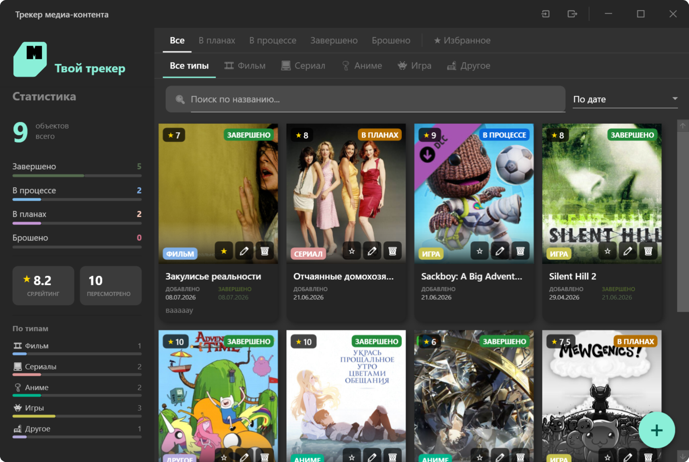

<p align="center">
    
</p>

<h1 align="center">
    MediaMonitor
</h1>

<p align="justify"><i>Список фильмов и сериалов обычно живёт в заметках на телефоне и быстро превращается в хаос. MediaMonitor - приложение на WPF для компьютера, которое наводит в этом порядок: карточка на каждый фильм, сериал, аниме или игру, со статусом, рейтингом и количеством повторных просмотров. Постер можно не искать вручную, приложение само подтянет его через Кинопоиск или Steam. Всё хранится локально, в обычном JSON-файле, без аккаунтов и облака.</i></p>

<p align="center">
    
    
    
    
    
    
</p>

## Возможности

- 📊 Статистика по коллекции: завершено / в процессе / в планах / брошено, средний рейтинг, число пересмотров
- 🔍 Поиск, фильтрация по статусу и типу, сортировка (по дате, названию, рейтингу, типу)
- 🖼️ Автопоиск постера (Кинопоиск API для фильмов/сериалов/аниме, Steam Store API для игр)
- 💾 Автосохранение коллекции в JSON (`%AppData%/MediaMonitor`)
- ⬇️⬆️ Экспорт / импорт коллекции в отдельный JSON-файл
- 🪟 Кастомный заголовок окна со своей иконкой, скруглёнными углами и запоминанием позиции/размера окна между запусками

## Скриншот

<p align="center">
    
</p>

## Сборка и запуск

Скачайте готовый .exe на странице [Releases](https://github.com/miyndeon/MediaMonitor/releases) или соберите из исходников:

```bash
git clone https://github.com/miyndeon/MediaMonitor.git
cd MediaMonitor
dotnet restore
dotnet build
dotnet run --project MediaMonitor
```

Либо откройте `MediaMonitor.slnx` в Visual Studio 2022+ и запустите проект.

## Структура проекта

```
MediaMonitor/
├── Converters/       # IValueConverter'ы для биндингов
├── Helpers/          # RelayCommand
├── Models/           # MediaItem, Enums, Statistics
├── Services/         # DataService, SettingsService, ThemeService
├── Themes/           # DarkTheme.xaml
├── ViewModels/       # MainViewModel, AddEditViewModel
├── Views/            # AddEditWindow
├── MainWindow.xaml   # Главное окно
└── App.xaml          # Точка входа, темы MaterialDesign
```

## Данные

Коллекция и настройки окна хранятся локально в:

```
%AppData%\MediaMonitor\media_data.json
%AppData%\MediaMonitor\app_settings.json
```

## Лицензия

Только для просмотра, копирование и использование в своих целях запрещено. Смотреть в [LICENSE](/LICENSE).
